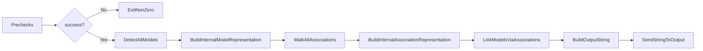

# The Plan

A gem that can be added to a rails applications Gemfile and installed as any other gem.
Gives the user a command `rerd generate` that will do the following:

1. Run some prechecks. Exits non zero if any fail with a descriptive message
   1. Check whether the user is in the root of a Rails project
   1. Check whether the application's ORM is ActiveRecord
1. Load all models
1. Build an internal representation of them
1. Walk through all associations
1. Add links to internal representation
1. Build and output string ERD using the supplied formatter
1. Send that output to the configured output destination
   - Defaults to stdout
   - Initial options can stdout or file

## MVP

# MVP TODO

- [ ] Rake setup
  - [ ] Build
  - [ ] Install
  - [ ] Clean
  - [ ] Run
- [ ] Cli command Generate
- [ ] Precheck Rails Project
- [ ] Precheck ORM
- [ ] More of this list

# Post MVP

## Config file

Will definitely want this but no need for v0.2.
Maybe a dotfile `.rails_auto_erd.yml`

## Other ORM's

Again probably at some point, but for first cut, lets just use ActiveRecord

## Other Formatters

Again probably at some point, but for first cut, simply going with mermaid js

## Configurable Generations

Will just generate the full ERD for the project for v0.2
After that should be able to configure specific generations
Among other things might want to use namespaces or set list of classes to document
